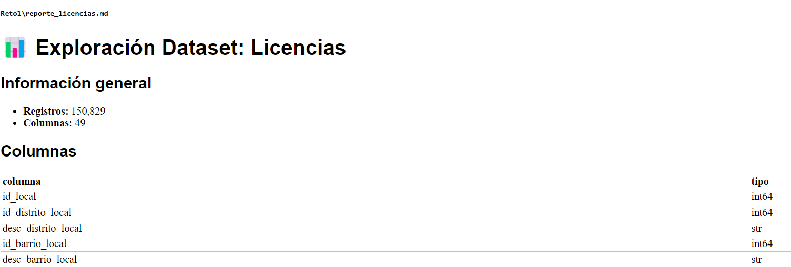
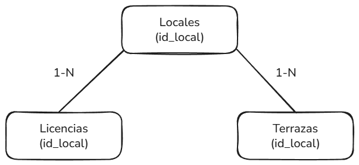
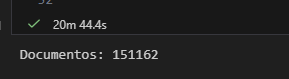
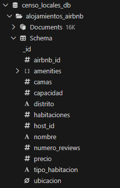
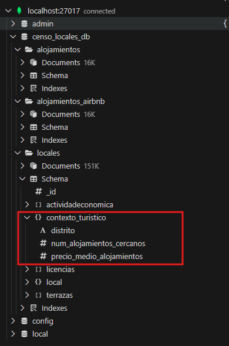
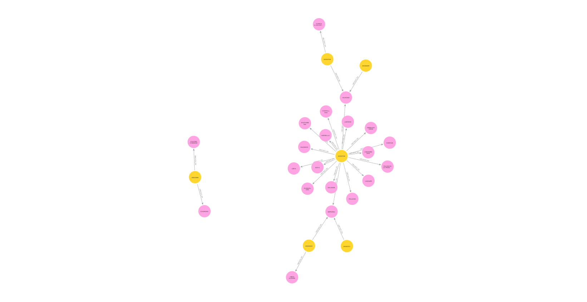
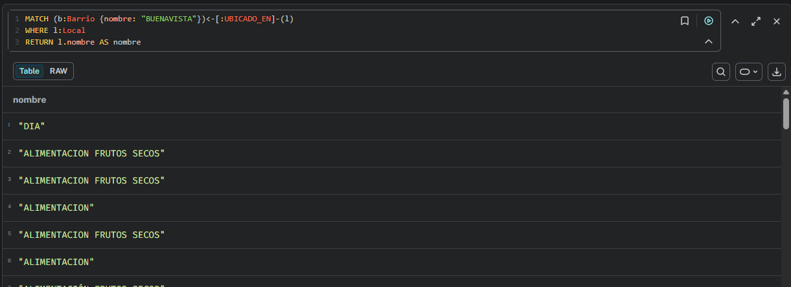

# Uso de Bases de Datos NoSQL

**Alumno:** _Roberto Sanchez Figueroa_
**Fecha:** _19/02/2026_
**Asignatura:** Bases de Datos NoSQL

---
**Repositorio:**  
https://github.com/brrsanchezfi/NoSQL_nticmaster  

> ⚠️ **Nota importante:**  
> Algunos enlaces pueden no funcionar correctamente en el archivo PDF debido a limitaciones del formato.  
> Para revisar todos los recursos y enlaces activos, se recomienda consultar el proyecto directamente desde GitHub.

---

## Índice

<!-- TOC -->

- [Uso de Bases de Datos NoSQL](#uso-de-bases-de-datos-nosql)
    - [Repositorio](#repositorio)
    - [Índice](#%C3%8Dndice)
    - [Introducción](#introducci%C3%B3n)
    - [RETO 1 – EXPLORACIÓN INICIAL DE LOS DATOS](#reto-1--exploraci%C3%93n-inicial-de-los-datos)
        - [Revisión inicial de los ficheros](#revisi%C3%B3n-inicial-de-los-ficheros)
            - [Comprensión del contexto de los datos](#comprensi%C3%B3n-del-contexto-de-los-datos)
        - [Revisión de campos y calidad de los datos](#revisi%C3%B3n-de-campos-y-calidad-de-los-datos)
            - [Exploración inicial con Python pandas](#exploraci%C3%B3n-inicial-con-python-pandas)
        - [Relaciones entre ficheros](#relaciones-entre-ficheros)
            - [Identificación de campos comunes](#identificaci%C3%B3n-de-campos-comunes)
            - [Verificación de relaciones mediante cruces](#verificaci%C3%B3n-de-relaciones-mediante-cruces)
            - [Conclusión sobre las relaciones](#conclusi%C3%B3n-sobre-las-relaciones)
            - [Estrategia en caso de integración](#estrategia-en-caso-de-integraci%C3%B3n)
    - [RETO 2 – MODELADO DE DATOS](#reto-2--modelado-de-datos)
        - [Diseño del modelo de datos](#dise%C3%B1o-del-modelo-de-datos)
            - [Implementación del modelo](#implementaci%C3%B3n-del-modelo)
        - [Uso del modelo mediante consultas](#uso-del-modelo-mediante-consultas)
            - [Diseno y ejecucion de consultas en MongoDB](#diseno-y-ejecucion-de-consultas-en-mongodb)
        - [Creación y uso de índices en MongoDB](#creaci%C3%B3n-y-uso-de-%C3%ADndices-en-mongodb)
        - [Modelo de datos Versión 2: Extensión con alojamientos turísticos](#modelo-de-datos-versi%C3%B3n-2-extensi%C3%B3n-con-alojamientos-tur%C3%ADsticos)
            - [Incorporación de datos de alojamientos turísticos](#incorporaci%C3%B3n-de-datos-de-alojamientos-tur%C3%ADsticos)
                - [a Revisión y obtención del dataset](#a-revisi%C3%B3n-y-obtenci%C3%B3n-del-dataset)
                - [b Carga de datos en MongoDB](#b-carga-de-datos-en-mongodb)
            - [Mejora del modelo de datos](#mejora-del-modelo-de-datos)
                - [a Mejora del modelo de datos](#a-mejora-del-modelo-de-datos)
            - [Consultas para validar el modelo](#consultas-para-validar-el-modelo)
                - [a Mejora del modelo de datos](#a-mejora-del-modelo-de-datos)
    - [RETO 3 – MODELADO DE DATOS](#reto-3--modelado-de-datos)
        - [Diseño del modelo de grafo](#dise%C3%B1o-del-modelo-de-grafo)
        - [Consultas sobre el grafo](#consultas-sobre-el-grafo)
    - [Conclusiones](#conclusiones)

<!-- /TOC -->
---

## Introducción

El presente documento describe el desarrollo de la actividad práctica correspondiente a la asignatura Uso de Bases de Datos NoSQL, cuyo propósito principal es analizar, modelar y explotar información procedente de distintos conjuntos de datos relacionados con el censo de locales y actividades económicas.

En una primera fase, se realiza una exploración inicial de los datos con el objetivo de comprender su estructura, identificar la calidad de la información y detectar posibles relaciones entre los diferentes ficheros disponibles. Para ello, se emplean herramientas de análisis en Python, especialmente la librería pandas, lo que permite obtener una visión preliminar sin necesidad de aplicar procesos exhaustivos de limpieza o transformación.

Posteriormente, se aborda el diseño e implementación de un modelo de datos en una base de datos NoSQL orientada a documentos, utilizando MongoDB, con el fin de almacenar la información de manera eficiente y facilitar la ejecución de consultas analíticas. Asimismo, se evalúa el rendimiento mediante el uso de índices y se propone una extensión del modelo que incorpora información adicional de alojamientos turísticos, enriqueciendo el contexto de análisis.

Finalmente, se explora un enfoque alternativo de modelado mediante bases de datos de grafos, permitiendo comparar diferentes paradigmas NoSQL y comprender sus ventajas según el tipo de problema y las relaciones existentes entre los datos.

---

## RETO 1 – EXPLORACIÓN INICIAL DE LOS DATOS

### Revisión inicial de los ficheros

#### Comprensión del contexto de los datos

Para la revisión inicial se analizó la documentación técnica proporcionada junto con los conjuntos de datos del Ayuntamiento de Madrid, correspondiente a los metadatos del Censo de Locales y Actividades, incluyendo información sobre locales, licencias asociadas y terrazas de hostelería. Esta documentación permitió identificar el origen administrativo de la información, su finalidad estadística y los campos clave de relación entre ficheros, especialmente el identificador id_local, que posibilita el cruce entre distintos datasets. Asimismo, se verificaron las recomendaciones sobre codificación **UTF-8** y la estructura de los archivos, con el fin de garantizar una correcta lectura e interpretación de los datos.

Posteriormente, se realizó una exploración preliminar a partir de los archivos en formato **JSON** utilizando herramientas de análisis de datos en Python. En esta fase se comprobó la estructura de los documentos, los tipos de datos, la consistencia de los campos. Todos los archivos fueron cargados mediante una función genérica de lectura en Python, usando la codificación adecuada:

```python
 def cargar_json(ruta) -> pd.DataFrame:
 with open(ruta, "r", encoding="utf-8") as f:
 data = json.load(f)

 return pd.DataFrame(data)
```

---

### Revisión de campos y calidad de los datos

#### Exploración inicial con Python (pandas)

Para comprobar la estructura, el contenido y la calidad general de los
datos, se desarrolló un script de exploración en Python utilizando la
librería **pandas**, que permitió analizar de forma homogénea los tres
datasets en formato JSON. Este script automatizo la generación de
información descriptiva para la fase inicial de análisis,
incluyendo dimensiones del dataset, columnas disponibles, tipos de
datos, valores nulos, registros duplicados, muestras de datos (`head`) y
estadísticas descriptivas (`describe`).

El proceso genera reportes en formato Markdown.

A continuación un fragmento representativo del script utilizado:

```python

 def explorar_dataset(nombre, data, output_md=True):
 """
 Explora un dataset JSON y muestra información básica
 """
   ...
 return df
```

Mediante esta herramienta se obtuvieron los siguientes elementos de
exploración para cada dataset:

- Shape (dimensiones)
- Columnas
- Tipos de datos
- Valores nulos
- Registros duplicados
- Primeras filas (head)
- Estadísticas descriptivas (describe)
- Reporte automático en Markdown

Los informes completos generados durante esta fase pueden consultarse en
las siguientes rutas:

- Ver detalles en [Exploración de locales](/Reto1/reporte_locales.md)
- Ver detalles en [Exploración de licencias](/Reto1/reporte_licencias.md)
- Ver detalles en [Exploración de Terrazas](/Reto1/reporte_terrazas.md)
- Ver detalles en [Exploración de Actividad Economica](/Reto1/reporte_actividadeconomica.md)

<p align="center">
 
</p>

---

### Relaciones entre ficheros

Durante el análisis exploratorio se identificaron posibles relaciones entre los tres conjuntos de datos analizados: **locales**,**Actividad Economica**,**licencias** y **terrazas**.
Dado lo que pudo inferir en la lectura de la documentacion de esto ficheros se tomo como conjetura que `id_local` puede servir con clave de referencia para todos los ficheros, por lo que se realizó una verificación empírica mediante análisis de columnas y cruces de información.

#### Identificación de campos comunes

Se compararon los nombres de columnas entre los datasets para detectar posibles claves compartidas:

```python
columnas_comunes = (
 set(df_locales.columns)
 & set(df_licencias.columns)
 & set(df_terrazas.columns)
 & set(df_actividadeconomica.columns)
)

print(columnas_comunes)
```

El resultado mostró múltiples campos en común, destacando especialmente:

- `id_local`
- `id_ndp_edificio`
- `id_distrito_local`
- `id_barrio_local`
- Coordenadas geográficas
- Información de situación y acceso del local

Entre todos ellos, el campo **id_local** se identifica como el principal candidato para establecer relaciones entre los ficheros, ya que actúa como identificador único del local dentro del censo.

#### Verificación de relaciones mediante cruces

Para validar la relación, se comprobó cuántos registros de un dataset existen en los otros:

```python
df_locales["id_local"].isin(df_licencias["id_local"]).sum()
df_locales["id_local"].isin(df_terrazas["id_local"]).sum()
df_locales["id_local"].isin(df_actividadeconomica["id_local"]).sum()
```

Resultados obtenidos:

- Coincidencias entre **locales y licencias**: 74.139 registros
- Coincidencias entre **locales y terrazas**: 6.767 registros
- Coincidencias entre **locales y actividadeconomica**: 169.559 registros

Posteriormente, se realizó un cruce directo entre locales y licencias:

```python
df_merge = df_locales.merge(df_licencias, on="id_local", how="inner")
print(df_merge.shape)
```

Resultado:

```
(150829, 96)
```

**Detalle importante**

El resultado:

```
df_merge.shape = (150829, 96)
```

significa:

El dataset de licencias tiene **150.829 filas**
Todas encontraron **match en locales**

Esto constituye una **evidencia muy fuerte de referencia** entre ambos datasets, confirmando que el campo `id_local` permitiria establecer relaciones consistentes entre la información de locales y sus licencias asociadas.

---

#### Conclusión sobre las relaciones

Se concluye que:

- Existe una relación clara entre los tres ficheros mediante el campo **id_local**.
- El dataset de **licencias** depende directamente del dataset de **locales**.
- El dataset de **terrazas** contiene un subconjunto de locales que disponen de terraza.
- La relación puede modelarse correctamente mediante un esquema relacional.

<p align="center">
 
</p>
---

#### Estrategia en caso de integración

En caso de necesitar integración:

- se debe usar `id_local` como clave primaria.
- Mantener documentos separados (locales, licencias, terrazas, actividadeconomica).

---

## RETO 2 – MODELADO DE DATOS

**Nota:** La base de datos se implementará utilizando un contenedor Docker para el despliegue de MongoDB y la API de Python **PyMongo** para la carga y manipulación de los datos.

### Diseño del modelo de datos

En el reto anterior (sección **2.3.3**) se evaluó la posibilidad de utilizar un modelo relacional; sin embargo, considerando la naturaleza de los datos, su origen en ficheros JSON y el objetivo de trabajar con una base de datos NoSQL orientada a documentos, se decidió implementar un modelo **embebido**. Este almacenara en un único documento la información principal del local junto con sus entidades relacionadas.

El diseño propuesto utiliza el campo **id_local** como identificador lógico del documento principal.

El modelo se estructura tomando como entidad raíz el **local**, dentro del cual se embeben las colecciones relacionadas de **licencias**, **terrazas** y, cuando aplica, información de **actividad económica**.

Ejemplo conceptual del documento:

```json
{
  "id_local": 12345,

  "local": {
    "...": "atributos del local"
  },

  "licencias": [
    {
      "...": "atributos de licencia"
    }
  ],

  "terrazas": [
    {
      "...": "atributos de terraza"
    }
  ],

  "actividadeconomica": [
    {
      "...": "atributos de actividad"
    }
  ]
}
```

---

#### Implementación del modelo

Para la implementación se desplegó una instancia de MongoDB mediante contenedores Docker, para su revision ingresar a la siguiente ruta [docker-compose](docker-compose.yml)

Adicional en el notebook [2_modelado.ipynb](Reto2\2_modelado.ipynb) esta implementada la contruccion del modelo semantico que se propuso y la carga de los documentos en la base de datos llamada **censo_locales_db**.

<p align="center">
 
</p>

---

### Uso del modelo mediante consultas

#### Diseno y ejecucion de consultas en MongoDB

a. El Total de locales y terrazas por distrito y barrio: construye una consulta que
permita obtener el total de locales y terrazas agrupados por cada distrito y
barrio.

```python
   {
      "$group": {
         "_id": {
               "distrito": "$local.desc_distrito_local",
               "barrio": "$local.desc_barrio_local"
         },
         "total_locales": {"$sum": 1},
         "total_terrazas": {"$sum": {"$size": "$terrazas"}}
      }
   },
   {
      "$sort": {
         "_id.distrito": 1,
         "_id.barrio": 1
      }
   }
```

b. Tipos de licencias y cantidad de licencias por cada tipo: crea una consulta para contar cuántas licencias hay de cada tipo en los datos.

```python
   [
      {"$unwind": "$licencias"},
      {
         "$group": {
               "_id": "$licencias.desc_tipo_licencia",
               "total": {"$sum": 1} # $count
         }
      },
      {"$sort": {"total": -1}}
   ]
```

c. Listado de locales y terrazas con licencias “En trámite”: diseña una consulta
que filtre y devuelva un listado detallado de locales y terrazas cuyo estado de
licencia sea “En trámite”.

```python
   [
   {
      "$unwind": "$licencias"
   },
   {
      "$match": {
         "licencias.desc_tipo_situacion_licencia": {
         "$regex": "En tramitación",
         "$options": "i"
         }
      }
   },
   {
      "$project": {
         "id_local": 1,
         "licencias.desc_tipo_situacion_licencia": 1,
         "local.desc_distrito_local": 1,
         "local.desc_barrio_local": 1
      }
   }
   ]
```

d. Consulta por sección, división y epígrafe de la actividad comercial: crea una consulta para clasificar locales y terrazas según los campos sección, división y
epígrafe.

```python
   [
   {
      "$unwind": "$actividadeconomica"
   },
   {
      "$group": {
         "_id": {
         "id_local": "$local.id_local",
         "id_seccion": "$actividadeconomica.id_seccion",
         "desc_seccion": "$actividadeconomica.desc_seccion",
         "id_division": "$actividadeconomica.id_division",
         "desc_division": "$actividadeconomica.desc_division",
         "id_epigrafe": "$actividadeconomica.id_epigrafe",
         "desc_epigrafe": "$actividadeconomica.desc_epigrafe"
         },
         "total": {
         "$sum": 1
         }
      }
   },
   {
      "$sort": {
         "total": -1
      }
   }
   ]
```

e. Actividad económica más frecuente por barrio y distrito: diseña una consulta que identifique cuál es la actividad económica predominante en cada barrio y distrito.

```python
   [
   {
      "$unwind": "$actividadeconomica"
   },
   {
      "$group": {
         "_id": {
         "distrito": "$local.desc_distrito_local",
         "barrio": "$local.desc_barrio_local",
         "actividad": "$actividadeconomica.desc_seccion"
         },
         "total": {
         "$sum": 1
         }
      }
   },
   {
      "$sort": {
         "total": -1
      }
   },
   {
      "$group": {
         "_id": {
         "distrito": "$_id.distrito",
         "barrio": "$_id.barrio"
         },
         "actividad_mas_frecuente": {
         "$first": "$_id.actividad"
         },
         "total": {
         "$first": "$total"
         }
      }
   },
   {
      "$project": {
         "_id": 0,
         "distrito": "$_id.distrito",
         "barrio": "$_id.barrio",
         "actividad_mas_frecuente": 1,
         "total": 1
      }
   }
   ]
```

f. Actualización de horarios de apertura y cierre de ciertos locales: modifica los horarios de apertura y cierre de un conjunto seleccionado de locales según un criterio que tú determines.

```python

   ## condicion arbitraria, se modifican la fecha del distrito "ARGANZUA"
   ## Un argumento puede ser mantenimientos nocturos que implique cerrar temprano y abrir tarde en el distrito "ARGANZUA"

   filtro = {
      "local.desc_distrito_local": {
                  "$regex": "ARGANZUELA",
                  "$options": "i"
               }
   }

   cantidad = collection.count_documents(filtro)

   print("Documentos que se modificarían:", cantidad)

```

Resultado:
`Documentos que se modificarían: 5933`

```python
   update = {
      "$set": {
         "local.horario_apertura": "08:00",
         "local.horario_cierre": "22:00"
      }
   }

   resultado_f = collection.update_many(filtro, update)

   print("Documentos modificados:", resultado_f.modified_count)

```

Resultado:
`Documentos modificados: 5933`

Adicionalmente, se generó un archivo llamado [Informe_consultas.md](/Reto2/Informe_consultas.md), el cual proporciona un mayor nivel de detalle sobre el rendimiento de cada consulta. No obstante, como apreciación general, todas las consultas se ejecutaron en tiempos inferiores a 300 milisegundos.

---

### Creación y uso de índices en MongoDB

Para realizar este ítem se ejecutó la consulta primero sin índice y luego con índice, capturando el tiempo de ejecución y el tipo de scan realizado sobre la colección mediante el comando explain().

a. Índice simple: crea un índice sobre un campo único, como el nombre del barrio. Asegúrate de que la búsqueda de documentos en base a este campo sea más eficiente.

```Python
   # solo en base al campo desc_barrio_local
   collection.create_index(
      [("local.desc_barrio_local", 1)],
      name="idx_barrio"
   )

   # consulta que se va a realizar

   filtro = {
    "local.desc_barrio_local": {
        "$regex": "^ACACIAS",
        "$options": "i"
    }
   }
```

**Ejecucion sin indice:**

```md
==================================================
📊 RESULTADO EXPLAIN
==================================================
Tiempo de ejecución: 172 ms
Documentos examinados: 151162
Claves de índice examinadas: 0

## Plan de ejecución ganador:

{ 'direction': 'forward',
'filter': { 'local.desc_barrio_local': { '$options': 'i',
                                           '$regex': '^ACACIAS'}},
'stage': 'COLLSCAN'}
```

**Ejecucion con indice:**

```md
==================================================
📊 RESULTADO EXPLAIN
==================================================
Tiempo de ejecución: 120 ms
Documentos examinados: 1236
Claves de índice examinadas: 151162

## Plan de ejecución ganador:

{ 'inputStage': { 'direction': 'forward',
'filter': { 'local.desc_barrio_local': { '$options': 'i',
                                                           '$regex': '^ACACIAS'}},
'indexBounds': { 'local.desc_barrio_local': [ '["", {})',
'[/^ACACIAS/i, '
'/^ACACIAS/i]']},
'indexName': 'idx_barrio',
'indexVersion': 2,
'isMultiKey': False,
'isPartial': False,
'isSparse': False,
'isUnique': False,
'keyPattern': {'local.desc_barrio_local': 1},
'multiKeyPaths': {'local.desc_barrio_local': []},
'stage': 'IXSCAN'},
'stage': 'FETCH'}
```

Observacion: Los tiempos de ejecución no muestran una diferencia muy significativa, especialmente tras múltiples ejecuciones, esto probablemente se debe a algun caché de la base de datos. Sin embargo, la mejora en el rendimiento es evidente al observar la reducción en la cantidad de documentos examinados, pasando de 151162 a 1236.

b. Índice compuesto: diseña un índice compuesto que combine los campos distrito y barrio. Este índice debe mejorar el rendimiento en consultas que incluyan ambos campos.

```Python
   # solo en base al campo desc_barrio_local y desc_barrio_local
   collection.create_index(
      [
         ("local.desc_distrito_local", 1),
         ("local.desc_barrio_local", 1)
      ],
      name="idx_distrito_barrio"
   )

   # consulta que se va a realizar

   filtro = {
      "local.desc_distrito_local": {
         "$regex": "^SALAMANCA",
         "$options": "i"
      },
      "local.desc_barrio_local": {
         "$regex": "^GUINDALERA",
         "$options": "i"
      }
   }
```

**Ejecucion sin indice:**

```md
==================================================
📊 RESULTADO EXPLAIN
==================================================
Tiempo de ejecución: 146 ms
Documentos examinados: 151162
Claves de índice examinadas: 0

## Plan de ejecución ganador:

{ 'direction': 'forward',
'filter': { '$and': [ { 'local.desc_barrio_local': { '$options': 'i',
'$regex': '^GUINDALERA'}},
                        { 'local.desc_distrito_local': { '$options': 'i',
'$regex': '^SALAMANCA'}}]},
'stage': 'COLLSCAN'}
```

**Ejecucion con indice:**

```md
==================================================
📊 RESULTADO EXPLAIN
==================================================
Tiempo de ejecución: 138 ms
Documentos examinados: 1825
Claves de índice examinadas: 151162

## Plan de ejecución ganador:

{ 'inputStage': { 'direction': 'forward',
'filter': { '$and': [ { 'local.desc_distrito_local': { '$options': 'i',
'$regex': '^SALAMANCA'}},
                                        { 'local.desc_barrio_local': { '$options': 'i',
'$regex': '^GUINDALERA'}}]},
'indexBounds': { 'local.desc_barrio_local': [ '["", {})',
'[/^GUINDALERA/i, '
'/^GUINDALERA/i]'],
'local.desc_distrito_local': [ '["", {})',
'[/^SALAMANCA/i, '
'/^SALAMANCA/i]']},
'indexName': 'idx_distrito_barrio',
'indexVersion': 2,
'isMultiKey': False,
'isPartial': False,
'isSparse': False,
'isUnique': False,
'keyPattern': { 'local.desc_barrio_local': 1,
'local.desc_distrito_local': 1},
'multiKeyPaths': { 'local.desc_barrio_local': [],
'local.desc_distrito_local': []},
'stage': 'IXSCAN'},
'stage': 'FETCH'}
```

Observacion: Reducción en la cantidad de documentos examinados, pasando de 151162 a 1825, quizas en una base de datos con mas cantidad de documentos se apreciaria diferencias notables en el tipo de consulta.

c. Índice de array: si tienes un campo que almacena un array (por ejemplo, una lista de actividades económicas asociadas a un local o terraza), crea un índice sobre ese campo para permitir búsquedas rápidas de documentos que contengan valores específicos en el array.

```Python
   # solo en base al campo desc_barrio_local y desc_barrio_local
   collection.create_index(
      [("actividadeconomica.desc_barrio_local", 1)],
      name="idx_actividad"
   )
   # consulta que se va a realizar

   filtro = {
      "actividadeconomica.desc_barrio_local": {
         "$regex": "^ARCOS"
      }
   }
```

**Ejecucion sin indice:**

```md
==================================================
📊 RESULTADO EXPLAIN
==================================================
Tiempo de ejecución: 210 ms
Documentos examinados: 151162
Claves de índice examinadas: 0

## Plan de ejecución ganador:

{ 'direction': 'forward',
'filter': {'actividadeconomica.desc_barrio_local': {'$regex': '^ARCOS'}},
'stage': 'COLLSCAN'}
```

**Ejecucion con indice:**

```md
==================================================
📊 RESULTADO EXPLAIN
==================================================
Tiempo de ejecución: 1 ms
Documentos examinados: 400
Claves de índice examinadas: 401

## Plan de ejecución ganador:

{ 'inputStage': { 'direction': 'forward',
'indexBounds': { 'actividadeconomica.desc_barrio_local': [ '["ARCOS", '
'"ARCOT")',
'[/^ARCOS/, '
'/^ARCOS/]']},
'indexName': 'idx_actividad',
'indexVersion': 2,
'isMultiKey': True,
'isPartial': False,
'isSparse': False,
'isUnique': False,
'keyPattern': {'actividadeconomica.desc_barrio_local': 1},
'multiKeyPaths': { 'actividadeconomica.desc_barrio_local': [ 'actividadeconomica']},
'stage': 'IXSCAN'},
'stage': 'FETCH'}
```

Observacion: Se evidenció un comportamiento distinto al esperado en las consultas. Inicialmente, estas se estaban construyendo utilizando un patrón simple de expresión regular junto con la opción **"$options": "i"** (búsqueda insensible a mayúsculas y minúsculas). Si bien se tenía conocimiento de que esta opción podía impactar el rendimiento, no se anticipaba que el efecto fuera tan significativo, llegando incluso a empeorar los tiempos de ejecución aun cuando existía un índice sobre el campo consultado.

En conclusión, un filtro mal definido puede afectar negativamente el rendimiento de una consulta, incluso en presencia de índices, especialmente cuando dicho filtro se aplica sobre el mismo campo indexado y obliga al motor a realizar exploraciones más amplias de lo esperado.

**Filtro mal definido**

```python
   filtro = {
      "actividadeconomica.desc_barrio_local": {
         "$regex": "^ARCOS",
         "$options": "i"
      }
   }
```

```md
==================================================
📊 RESULTADO EXPLAIN
==================================================
Tiempo de ejecución: 472 ms
Documentos examinados: 151161
Claves de índice examinadas: 151161

## Plan de ejecución ganador:

{ 'filter': { 'actividadeconomica.desc_barrio_local': { '$options': 'i',
                                                        '$regex': '^ARCOS'}},
'inputStage': { 'direction': 'forward',
'indexBounds': { 'actividadeconomica.desc_barrio_local': [ '["", '
'{})',
'[/^ARCOS/i, '
'/^ARCOS/i]']},
'indexName': 'idx_actividad',
'indexVersion': 2,
'isMultiKey': True,
'isPartial': False,
'isSparse': False,
'isUnique': False,
'keyPattern': {'actividadeconomica.desc_barrio_local': 1},
'multiKeyPaths': { 'actividadeconomica.desc_barrio_local': [ 'actividadeconomica']},
'stage': 'IXSCAN'},
'stage': 'FETCH'}
```

Las pruebas se realizaron en el notebook [E2_indices.ipynb](/Reto2/2_indices.ipynb)

### Modelo de datos (Versión 2): Extensión con alojamientos turísticos

#### Incorporación de datos de alojamientos turísticos

##### a Revisión y obtención del dataset

Se tomo el fichero que viene con el ejercicio y se le aplico la misma funcion de exploracion, por favor en el siguiente link puede ver el resumen del informe exploratorio para identificar la estructura, tipos de datos, valores nulos y posibles inconsistencias.

- Ver detalles en [Exploración de Airbnb](/Reto2/reporte_airbnb.md)

Durante la revisión se observaron las siguientes características relevantes:

- El dataset contiene 16,313 registros con información de alojamientos.

- -Existe un campo `clave neighbourhood_group_cleansed` renombrado como `distrito`, que permite relacionar los alojamientos con distritos o barrios en locales.

- El campo location incluye coordenadas geográficas sin embargo tratar de cargar con ellas sea algo complicado.

- Ademas no se encontro una relacion directa de relacion uno a uno entre los datos..

Se decidió eliminar atributos no relevantes para el análisis, como pais.

##### b Carga de datos en MongoDB

Se optó por almacenar los datos en una colección independiente llamada: `alojamientos_airbnb`

```
{'_id': ObjectId('69965abd8cca00326b44cb48'),
 'airbnb_id': 18628,
 'amenities': [],
 'camas': 1.0,
 'capacidad': 2,
 'distrito': 'Centro',
 'habitaciones': 0.0,
 'host_id': 71597,
 'nombre': 'Greta Studio Wifi Chueca en Madrid',
 'numero_reviews': 37,
 'precio': 54.0,
 'tipo_habitacion': 'Entire home/apt',
 'ubicacion': None}
```

<p align="center">
 
</p>

#### Mejora del modelo de datos

La mejora del modelo de datos se realizó para integrar la información de alojamientos turísticos con los datos de actividad comercial, de manera que sea posible analizar la relación entre el turismo y los negocios en una zona determinada.

Antes de la mejora, la base de datos solo contenía información sobre la actividad comercial, lo cual aporta un contexto útil respecto a los alojamientos turísticos, pero no permitía relacionar directamente ambos fenómenos. Por ello, no era posible estudiar aspectos como:

-Si en los distritos con más alojamientos hay más actividad económica.

-Cómo puede influir el turismo en la apertura de negocios o terrazas.

-Las zonas con mayor concentración turística y comercial.

Al incorporar los datos de Airbnb y relacionarlos mediante el campo común distrito, se consigue enriquecer la información existente y permitir nuevos tipos de consultas y análisis.

Para ello, se creó una nueva colección de alojamientos turísticos con los datos procedentes del dataset de Airbnb y se añadió información agregada dentro de los documentos de locales comerciales mediante un subdocumento llamado contexto_turistico. Este subdocumento incluye el número de alojamientos existentes en el distrito y el precio medio de los mismos, lo que permite disponer de información relevante sin necesidad de realizar cálculos complejos en cada consulta.

De esta forma, el modelo mantiene la flexibilidad propia de las bases de datos NoSQL y, al mismo tiempo, permite realizar análisis conjuntos entre turismo y actividad económica.

##### a Mejora del modelo de datos

1. Nueva coleccion llamada alojamientos.

```python

   collection_alojamientos = db["alojamientos"]

   nuevo_doc = {
        "airbnb_id": doc.get("airbnb_id"),
        "nombre": doc.get("nombre"),

        "ubicacion": {
            "distrito": (doc.get("distrito") or "").strip().upper() or None,
            "barrio": None,
            "coordenadas": None
        },

        "propiedad": {
            "tipo_habitacion": doc.get("tipo_habitacion"),
            "capacidad": doc.get("capacidad"),
            "habitaciones": doc.get("habitaciones"),
            "camas": doc.get("camas")
        },

        "precio": doc.get("precio"),
        "numero_reviews": doc.get("numero_reviews"),

        "host": {
            "host_id": doc.get("host_id")
        },

        "amenities": doc.get("amenities", [])
    }

```

#### Consultas para validar el modelo

##### a Mejora del modelo de datos

Para validar el modelo mejorado, se realiza una agregación sobre la colección de alojamientos con el objetivo de obtener estadísticas por distrito, concretamente el número total de alojamientos y el precio medio.

```python
# Pipeline de agregación para calcular estadísticas de alojamientos por distrito
pipeline = [
   {
      "$group": {
            "_id": "$ubicacion.distrito",
            "num_alojamientos": {"$sum": 1},
            "precio_medio": {"$avg": "$precio"}
      }
   }
]

```

Una vez obtenidas las estadísticas, se construye un subdocumento con la información agregada del distrito que será incorporado en los documentos de locales. Esto permite disponer de información turística sin necesidad de realizar cálculos complejos en cada consulta.

```python
   # Creación del subdocumento que se añadirá a cada local
   # con información turística agregada del distrito
   contexto = {
      "distrito": distrito,
      "num_alojamientos_cercanos": data["num_alojamientos"],
      "precio_medio_alojamientos": data["precio_medio"]
   }
```

<p align="center">
 
</p>

---

## RETO 3 – MODELADO DE DATOS

### Diseño del modelo de grafo

Se cargaron los siguientes Nodos

```cql
<!-- Barrio -->
LOAD CSV WITH HEADERS
FROM 'file:///locales202312.csv' AS row_locales
FIELDTERMINATOR ';'

WITH DISTINCT trim(row_locales.desc_barrio_local) AS barrio
WHERE barrio IS NOT NULL AND barrio <> ""

MERGE (b:Barrio {nombre: barrio});


<!-- local -->
LOAD CSV WITH HEADERS
FROM 'file:///locales202312.csv' AS row_locales
FIELDTERMINATOR ';'
LIMIT 1000

MERGE (l:Local {id:row_locales.id_local})
SET l.nombre = row_locales.rotulo,
    l.barrio = row_locales.desc_barrio_local,
    l.hora_apertura1 = row_locales.hora_apertura1,
    l.hora_cierre1 = row_locales.hora_cierre1;

<!-- terraza -->
LOAD CSV WITH HEADERS
FROM 'file:///locales202312.csv' AS row_locales
FIELDTERMINATOR ';'
LIMIT 1000

MERGE (l:Local {id:row_locales.id_local})
SET l.nombre = row_locales.rotulo,
    l.barrio = row_locales.desc_barrio_local,
    l.hora_apertura1 = row_locales.hora_apertura1,
    l.hora_cierre1 = row_locales.hora_cierre1;

```

y se hicieron las siguientes referncias de prueba

```cql
LOAD CSV WITH HEADERS
FROM 'file:///terrazas202312.csv'
AS row_terrazas
FIELDTERMINATOR ';'

MERGE (t:Terraza {id:row_terrazas.id_local})
SET t.nombre = row_terrazas.rotulo,
    t.barrio = trim(row_terrazas.desc_barrio_local);


LOAD CSV WITH HEADERS
FROM 'file:///locales202312.csv' AS row_locales
FIELDTERMINATOR ';'

MATCH (l:Local {barrio: row_locales.desc_barrio_local})
MATCH (b:Barrio {nombre: trim(row_locales.desc_barrio_local)})

MERGE (l)-[:UBICADO_EN]->(b);

```

**Locales hubicados en tal barrio**

<p align="center">
 
</p>

**Locales que son terraza hubicado en un barrio (limit tomo un barrio)**

<p align="center">
 
</p>

### Consultas sobre el grafo

Consulta todos los locales y terrazas del barrio “Salamanca”.
REEMPLAZADO 'BUENAVISTA'

```cql
MATCH (b:Barrio {nombre: "BUENAVISTA"})<-[:UBICADO_EN]-(l)
WHERE l:Local
RETURN l.nombre AS nombre
```

```csv
<!-- resultado recortado -->
nombre

BAR
LIDL
CHARCUTERIA
LOCUTORIO
ALIMENTACION
ALIMENTACION FRUTOS SECOS
SR
NAILS FACTORY
BURGER KING
EL MADROÑO
```

**Locales que son terraza hubicado en un barrio (limit tomo un barrio)**

<p align="center">
 
</p>

Consulta los alojamientos cuyo precio supere los 100€.

No se agregaron propiedades de airbnb

Consulta los barrios donde los alojamientos no cuentan con dormitorios.

No se agregaron propiedades de airbnb

Consulta los barrios donde los alojamientos no cuentan con reseñas.

No se agregaron propiedades de airbnb

## Conclusiones

- En el desarrollo del trabajo pude entender que MongoDB y Neo4j tienen enfoques diferentes para el manejo de datos, ya que MongoDB se basa en documentos y Neo4j en grafos, lo que hace que cada uno sea más adecuado para ciertos tipos de problemas.

- Se pudo observarque MongoDB resulta muy útil cuando se necesita flexibilidad en la estructura de la información y escalabilidad, mientras que Neo4j es más eficiente cuando lo más importante son las relaciones entre los datos, sin embargo el rendimiento de Neo4j fue un poco mas deficiente, aclarando que se uso un ordenador domestico.

- Considero que el rendimiento de cada tecnología depende mucho del caso de uso, porque MongoDB funciona muy bien con grandes volúmenes de información, pero Neo4j puede ser superior cuando se realizan consultas complejas de relaciones.

- Durante la práctica MongoDB tiene una curva de aprendizaje más sencilla, especialmente para quienes ya conocen estructuras tipo JSON, mientras que Neo4j requiere aprender nuevos conceptos como nodos, relaciones y el lenguaje Cypher.

- Otra conclusión importante es que estas bases de datos no necesariamente compiten entre sí, sino que pueden complementarse dentro de un mismo sistema dependiendo de las necesidades del proyecto.